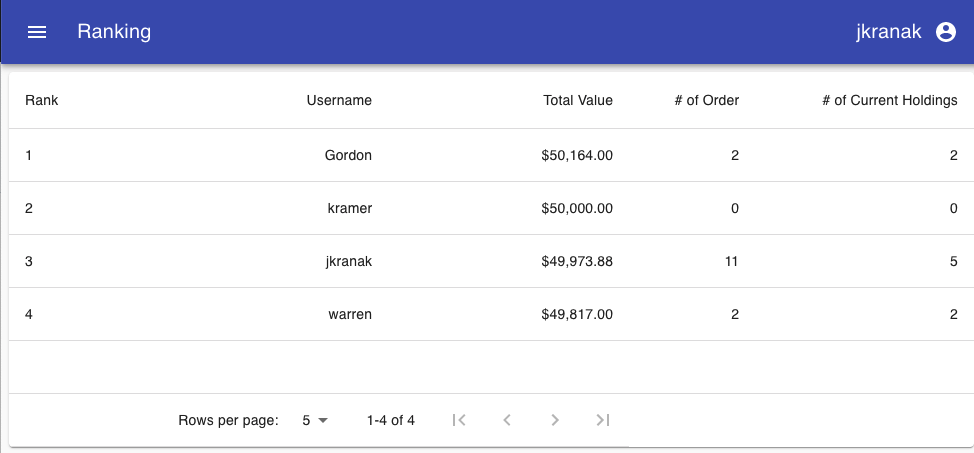

# Practise Investor
## About The Project
Pactise Investor allows users to buy and sell stock with real-time stock market prices with fake money. It allows users to practise investing with zero risk, has features such as porfolio diversity metrics, stock holdings metrics, top news in the stock market, and an application ranking feature to add gamification.





### Built With

* Front End: [React](https://reactjs.org/), [Redux](https://redux.js.org/), [Material UI](https://material-ui.com/), [Axios](https://axios-http.com/), [CanvasJS](https://canvasjs.com/), [Apex Charts](https://apexcharts.com/)
* Back End: [MongoDB](https://www.mongodb.com/), [Mongoose](https://mongoosejs.com/), [NodeJS](https://nodejs.org/en/), [Express](http://expressjs.com/), [JWT](https://jwt.io/)
* Others: [Typescript](https://www.typescriptlang.org/)

## Getting Started

To get a local copy up and running follow these steps.

### Prerequisites

* npm
  ```sh
  npm install npm@latest -g
  ```

### Installation

1. You will need an API key from [TwelveData](https://twelvedata.com/)
2. Clone the repo
   ```sh
   git clone https://github.com/sarahjoychan/PractiseInvestor
   ```
3. Install NPM packages
   ```sh
   npm install
   ```
4. Enter your API in `Back-end/.env`
   ```JS
   API_KEY==your_api_key;
   ```
6. Create a MongoDb database
5. Populate name and ticker api
```js
const url = 'https://api.twelvedata.com/stocks';
const getStocks = () => {
  request({ url, json: true }, (error, response) => {
    const { data } = response.body;
    const filteredData = data.filter((stock) => stock.exchange === 'NASDAQ' && stock.type === 'Common Stock');
    const deleteProperties = filteredData.map((stock) => ({ symbol: stock.symbol, name: stock.name }));
    try {
      Stock.insertMany(deleteProperties);
    } catch (err) {
      console.log(err);
    }
  });
};
getStocks();
```
6. Running the application:
```sh
PractiseInvestor/Back-end % nodemon start.ts
PractiseInvestor/Front-end % npm start
```

## Contributors
* Rahmat Yousufi [![LinkedIn][linkedin-shield]](https://www.linkedin.com/in/rahmatyousufi/)
* Joseph Kranak [![LinkedIn][linkedin-shield]](https://www.linkedin.com/in/joseph-kranak/)
* Bianca Procopio [![LinkedIn][linkedin-shield]](https://www.linkedin.com/in/bianca-procopio/)
* Sarah Shaffer [![LinkedIn][linkedin-shield]](https://www.linkedin.com/in/sarah-shaffer-63a662208/)


[linkedin-shield]: https://img.shields.io/badge/-LinkedIn-black.svg?style=for-the-badge&logo=linkedin&colorB=555
[linkedin-url]: https://linkedin.com/in/othneildrew
